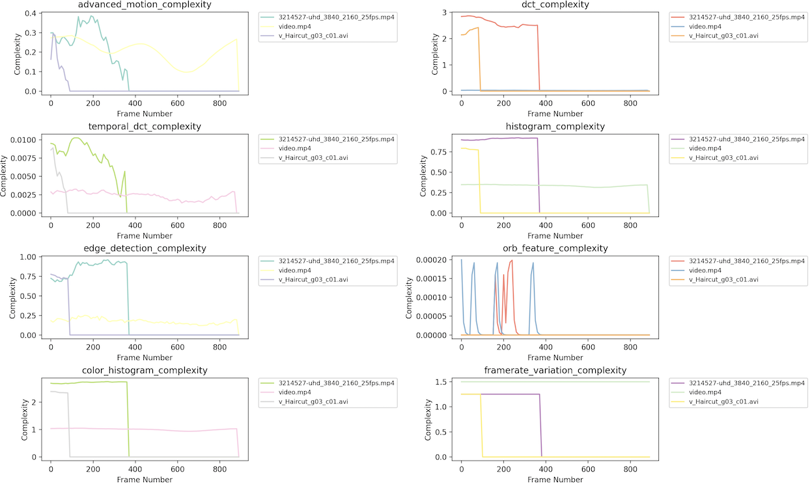

# Video Scene Complexity Analyzer

This tool computes scene complexity metrics for videos, such as motion, edge detection, DCT, ORB features, and more. The tool processes all videos in a folder, visualizes complexity metrics over time, and compares results across different videos.

## Features

	- Scene Complexity Metrics: Analyze advanced metrics like motion, DCT, ORB, and edge detection.
	- Batch Processing: Automatically processes all videos in a given folder.
	- Visualization: Compare complexity metrics across videos on the same graph.
	- Configurable: Define parameters such as frame size, smoothing factor, and batch size in a JSON configuration file.


### Installation
1.	Clone the repository:
  ```bash
  git clone https://github.com/zaki699/scene_complexity
  cd  scene_complexity
  ```

2.	Install required Python libraries:
  ```bash
    pip install -r requirements.txt
  ```

### Configuration

Set your configuration options in the config.json file. Example configuration:

```json
{
    "resize_width": 64,
    "resize_height": 64,
    "frame_interval": 10,
    "smoothing_factor": 0.8,
    "batch_size": 100,
    "num_workers": 4
}
```

	- resize_width: Specifies the width to which frames will be resized during processing. A smaller width (e.g., 64) reduces computational cost.
	- resize_height: Specifies the height to resize frames, also aimed at reducing processing time.
	- frame_interval: The number of frames to skip between each processed frame. A higher value reduces the total number of frames analyzed.
	- smoothing_factor: Controls the amount of smoothing applied to data, with values closer to 1 applying heavier smoothing.
	- batch_size: Number of frames to process in each batch, improving efficiency by handling multiple frames at once.
	- num_workers: Number of CPU cores used for parallel processing. More workers increase speed but require more system resources.

### Usage

	1.	Place your videos in a folder, e.g., videos/.
	2.	Run the scene complexity analysis:

 ```bash
python plot_video_scene_complexity_across_folder.py <config_file> <folder_path>
```

Run the classifier by providing the video path and configuration file as follows:
```bash
python classify_video.py config.json path_to_video.mp4
```

Example Output

After processing, the script will display the complexity score and classification for the video:
```bash
--- Video Analysis: path_to_video.mp4 ---
Total Complexity Score: 0.78
Classification: High Complexity
-----------------------------------------
```


## Metrics Analyzed

	- Motion Complexity: Measures movement between frames.
	- DCT Complexity: Uses the Discrete Cosine Transform to analyze visual complexity.
	- Edge Detection: Uses Canny edge detection to measure sharp transitions.
	- ORB Features: Detects keypoints and computes visual features.
	- Color Histogram Complexity: Analyzes the distribution of colors over frames.
	- Temporal DCT: Evaluates changes in DCT over time.
	- Frame Rate Variation: Measures the variation in frame rate.

 ## Metrics Normalized 
 Define the min and max values for normalization (based on observed data ranges) 
 
 ```json

    min_max_values = {
        'advanced_motion_complexity': (0.0, 10.0),
        'dct_complexity': (1e6, 5e7),
        'temporal_dct_complexity': (0.0, 1e7),
        'histogram_complexity': (0.0, 8.0),
        'edge_detection_complexity': (0.0, 1.0),
        'orb_feature_complexity': (0.0, 5000),
        'color_histogram_complexity': (0.0, 8.0),
        'smoothed_framerate_variation': (0.0, 2.0)
    }
```

## Important
When videos have different durations, the array sizes for the calculated metrics may not align. During the process of plotting or aggregating the data, shorter videos would result in fewer data points, leaving gaps in the metric arrays. By padding shorter arrays with zeros or other placeholders, you can ensure that all arrays have the same length, allowing proper comparison across videos. However, filling with zeros can affect the visual representation or analysis, since zero values may indicate no complexity, which might not be accurate for a scene.

## Output



## License

MIT License
